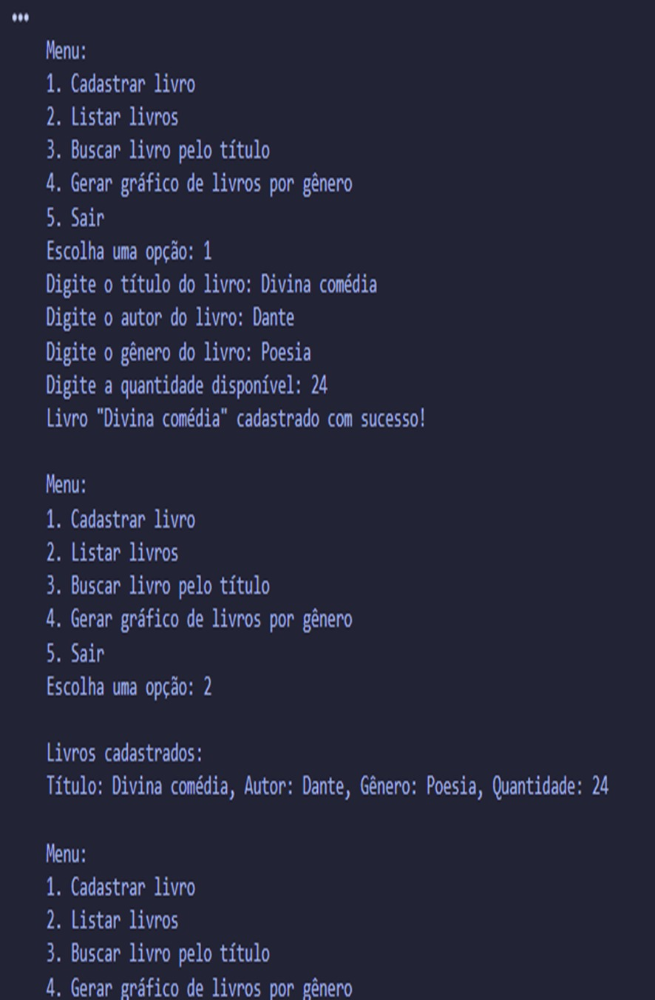

# Exercícios de Python - Faculdade

## Exercícios de Python feitos na minha faculdade de Engenharia de Software

Este repositório contém uma coleção de exercícios práticos desenvolvidos ao longo do curso de Engenharia de Software. Cada projeto aborda diferentes conceitos e habilidades em Python, desde a manipulação básica de dados até a implementação de técnicas de machine learning.

---

## 1° Exercício: Contador de Notas Escolares

Um projeto simples que calcula as notas de um aluno e exibe o resultado final, indicando se ele foi aprovado ou reprovado. Este exercício é uma ótima introdução à lógica condicional e ao controle de fluxo em Python.

![Contador de Notas Escolares]

---

## 2° Exercício: CRUD de Livraria

Neste exercício, você pode cadastrar, listar, buscar e criar gráficos para uma livraria. É possível gerar gráficos com base nos gêneros dos livros e autores, permitindo uma visualização clara dos dados da biblioteca.

---

## 3° Exercício: Gerenciamento de Vendas com Gráfico

Este projeto permite gerenciar suas vendas com base em IDs e valores dos produtos. Além disso, gráficos podem ser gerados com base nos tipos de produtos, facilitando a análise de vendas e tendências.

 
 

---

## 4° Exercício: Machine Learning Simples

Um projeto introdutório que aplica técnicas básicas de machine learning. Os conceitos abordados incluem a preparação de dados, treinamento de modelos e previsões, oferecendo uma base sólida para estudos futuros na área.

---

## Contribuição

Se você deseja contribuir com este repositório, sinta-se à vontade para enviar pull requests ou abrir issues. Toda contribuição é bem-vinda!

## Licença

Este projeto está licenciado sob a MIT License - consulte o arquivo [LICENSE](LICENSE) para mais detalhes.
